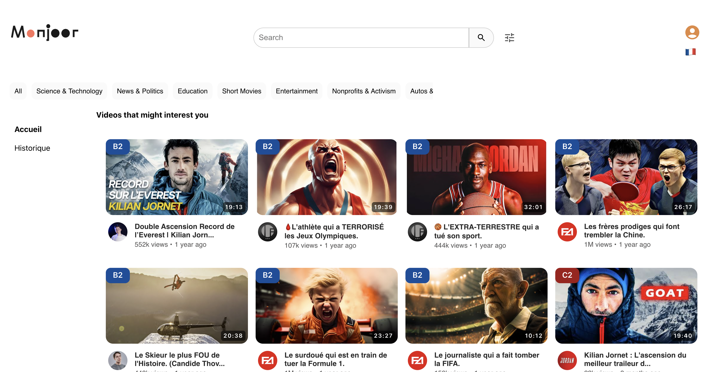

# Client App

## Introduction

The **Client App** is the user-facing interface of the Monjoor platform, designed to deliver a personalized, video-based language learning experience powered by Large Language Models (LLMs). Users can browse, search, and interact with curated language learning videos, access transcripts, receive real-time translation, and benefit from AI-driven recommendations—all through a clean and intuitive web interface.

The app is built with **React** and communicates with the backend via RESTful APIs. It is optimized for modern browsers and designed for easy deployment both locally and in the cloud.

## Most important

* **Production URL**: [https://client-dot-monjoor-2025.oa.r.appspot.com/](https://client-dot-monjoor-2025.oa.r.appspot.com/)


## Environment Configuration

Before starting the app, create a `.env` file in the project root with the following variables:

* **Update `REACT_APP_API_URL` depending on your setup:**

  * For local development, use your local backend:
    `REACT_APP_API_URL='http://localhost:3000'`
  * For production/deployed version, use the deployed backend URL:
    `REACT_APP_API_URL='https://monjoor-backend-203751395944.europe-west6.run.app'`

* **Configure Elasticsearch:**

  * Set the index name:
    `REACT_APP_INDEX_NAME='your_index_name'`
  * Set the API key:
    `REACT_APP_API_KEY='your_api_key'`

* **Set the client port (recommended: avoid conflict with backend):**
  `PORT=3001`

**Example `.env`:**

```env
# Backend API URL (choose one)
REACT_APP_API_URL='http://localhost:3000'
# REACT_APP_API_URL='https://monjoor-backend-203751395944.europe-west6.run.app'

# Elasticsearch configuration
REACT_APP_INDEX_NAME='your_index_name'
REACT_APP_API_KEY='your_api_key'

# Port for client app
PORT=3001
```


## Deployment

### Deploying using npm

To run the client locally with npm:

```bash
# 1. Install dependencies
npm install

# 2. Start the development server
npm start
```

* The app will run at `http://localhost:3001/`
* Hot reloading is enabled.
* **Node.js 18+** recommended.

### Deploy on Docker locally

To run the client app in a Docker container on your machine:

```bash
docker build -t monjoor-client .
docker run -p 3001:80 monjoor-client
```

* The app will be accessible at [http://localhost:3001](http://localhost:3001)
* Make sure Docker is installed and running.

### Deploy on Google Cloud

Deployment on Google Cloud Platform (App Engine):

```bash
npm run build
gcloud app deploy
gcloud app browse
```

* The app is deployed in **App Engine Standard Environment**.
* Make sure you are authenticated with `gcloud` and have the correct project selected.
* Update your `app.yaml` configuration if necessary.

---

## Additional Information

* **Frontend Framework:** React
* **API Communication:** RESTful endpoints to the backend
* **Supported Browsers:** Latest versions of Chrome, Firefox, Edge, Safari

## Troubleshooting

* If you encounter errors with API requests, check that your backend server is running and CORS policies are correctly configured.
* For Google Cloud deployments, ensure your billing is enabled and quotas are sufficient.

---

Let me know if you want to add a features section, contributors, or anything else!
