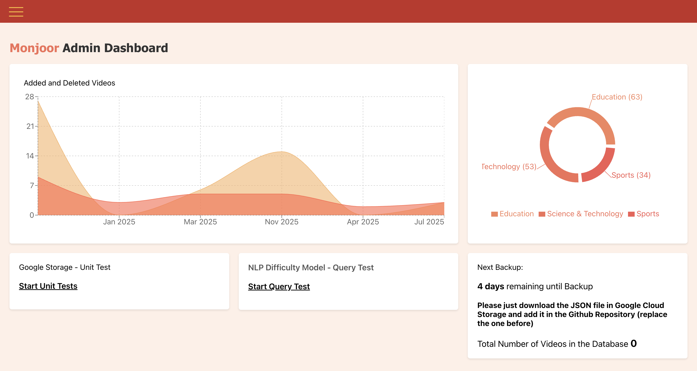

# Admin App

## Introduction

The **Admin App** is the administrator interface for the Monjoor platform. It provides powerful tools to manage, monitor, and curate language learning content, as well as to supervise the platform’s operational status. Platform managers can upload new videos, edit metadata, check difficulty model performance, review statistics, and ensure the system runs smoothly—all from an intuitive React-based dashboard.

Just like the client app, the admin app communicates with the backend via RESTful APIs and is designed for seamless deployment both locally and in the cloud.

## Most important

* **Production URL**: [https://admin-dot-monjoor-2025.oa.r.appspot.com/](https://admin-dot-monjoor-2025.oa.r.appspot.com/)

## Environment Configuration

Before starting the app, create a `.env` file in the project root with the following variable:

* **Update `REACT_APP_API_URL` depending on your setup:**

  * For local development, use your local backend:
    `REACT_APP_API_URL='http://localhost:3000'`
  * For production/deployed version, use the deployed backend URL:
    `REACT_APP_API_URL='https://monjoor-backend-203751395944.europe-west6.run.app'`

* **Set the admin app port (recommended: avoid conflict with backend/client):**
  `PORT=3002`

**Example `.env`:**

```env
# Backend API URL (choose one)
REACT_APP_API_URL='http://localhost:3000'
# REACT_APP_API_URL='https://monjoor-backend-203751395944.europe-west6.run.app'

# Port for admin app
PORT=3002
```

## Deployment

### Deploying using npm

To run the admin app locally with npm:

```bash
# 1. Install dependencies
npm install

# 2. Start the development server
npm start
```

* The app will run at `http://localhost:3002/`
* Hot reloading is enabled.
* **Node.js 18+** recommended.

### Deploy on Docker locally

To run the admin app in a Docker container on your machine:

```bash
docker build -t monjoor-admin .
docker run -p 3002:80 monjoor-admin
```

* The app will be accessible at [http://localhost:3002](http://localhost:3002)
* Make sure Docker is installed and running.

### Deploy on Google Cloud

Deployment on Google Cloud Platform (App Engine):

```bash
npm run build
gcloud app deploy
gcloud app browse
```

* The app is deployed in **App Engine Standard Environment**.
* Make sure you are authenticated with `gcloud` and have the correct project selected.
* Update your `app.yaml` configuration if necessary.

---

## Additional Information

* **Frontend Framework:** React
* **API Communication:** RESTful endpoints to the backend
* **Supported Browsers:** Latest versions of Chrome, Firefox, Edge, Safari

## Troubleshooting

* If you encounter errors with API requests, check that your backend server is running and CORS policies are correctly configured.
* For Google Cloud deployments, ensure your billing is enabled and quotas are sufficient.
