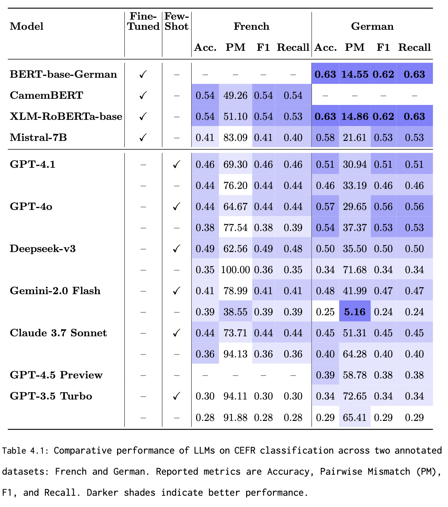

Of course! Here’s your improved README with an image section at the top.
Just **replace the image filename** (`Summary-Results.png`) with your actual image file in the repo (e.g., a confusion matrix, results summary, or final leaderboard).
If your image is in `6-Images/`, adapt the path accordingly.

---

# Difficulty Classification Study

*Final summary of model performances for CEFR-level sentence difficulty classification in German and French.*

---

## Overview

This folder contains the experiments and datasets used in the **Difficulty Classification Study** section of the Monjoor project and my master’s thesis.
The goal of this study is to evaluate the ability of various language models to automatically classify text difficulty in alignment with the **Common European Framework of Reference for Languages (CEFR)** levels, in both **German** and **French**.

---

## Contents

* **Datasets**

  * `Model-Exploration/German/Data/`: Labeled sentence-level CEFR datasets for German (A1–C2)
  * `Model-Exploration/French/data/`: Labeled sentence-level CEFR datasets for French (A1–C2)

* **Notebooks**

  * Complete evaluation notebooks for all major experiments, including zero-shot and few-shot prompting, fine-tuning, and baseline comparisons:

    * `Model-Exploration/German/`: Training and evaluation for German (multiple models)
    * `Model-Exploration/French/`: Training and evaluation for French (multiple models)

* **Predictions & Results**

  * Direct outputs of all evaluated models, including:

    * Predictions from OpenAI GPT-3.5/4, Gemini, Claude, Deepseek, Mistral, CamemBERT, XLM-RoBERTa, and others
    * Confusion matrices and performance metrics

---

## Summary of Experiments

* **Supervised fine-tuning:**
  Trained transformer models (e.g., CamemBERT, XLM-RoBERTa) on labeled CEFR datasets for sentence-level difficulty prediction.
* **Zero-shot and few-shot prompting:**
  Evaluated LLMs (GPT-4, Gemini, Claude, Mistral) on classification without task-specific training.
* **Cross-lingual evaluation:**
  Benchmarked models on both German and French, comparing cross-lingual generalization.

---

## Key Results

* **Fine-tuned transformer models** (like XLM-RoBERTa, CamemBERT) provide strong baselines for CEFR-level prediction, outperforming zero-shot LLMs on in-domain test data.
* **LLMs** (e.g., GPT-4, Gemini) demonstrate promising generalization in zero-shot and few-shot settings, especially for mid-level CEFR categories (B1/B2).
* **Pairwise mismatch** and confusion matrix analysis highlight strengths and weaknesses of each approach, with supervised models excelling in granularity and LLMs providing adaptability across unseen data.

---

## Usage

* **To reproduce experiments:**
  Open the relevant Jupyter notebooks in `Model-Exploration/German/` or `Model-Exploration/French/` and follow the provided instructions.
* **To access datasets:**
  Data is available in the `data/` subfolders for French and German, in CSV and JSONL formats.
* **To evaluate new models:**
  Use the provided notebooks as templates for benchmarking additional approaches.

---

## Citation

If you use these datasets or results, please cite the corresponding thesis or the Monjoor platform.

