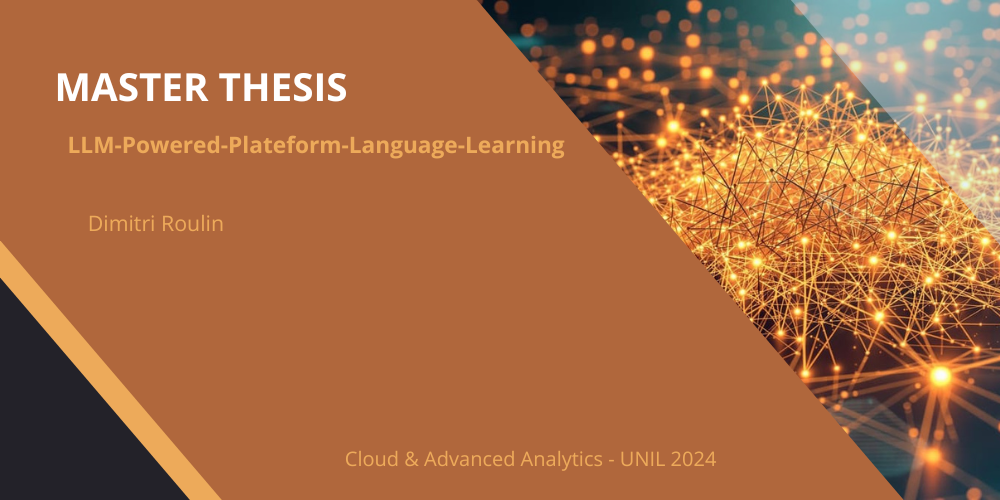
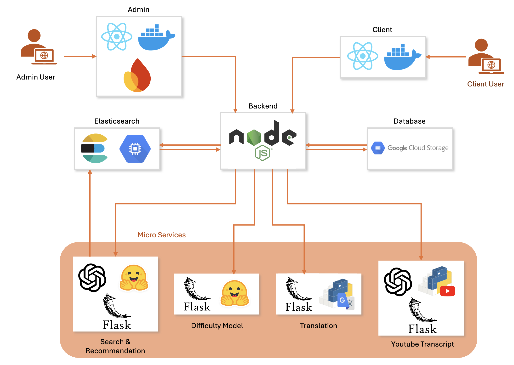

# *Master-Thesis-LLM-Powered-Plateform-Language-Learning*

---

## Table of Contents

* [Project Overview](#project-overview)
* [System Architecture](#system-architecture)
* [Modules](#modules)
* [Getting Started](#getting-started)
* [Deployment](#deployment)
* [Documentation](#documentation)
* [Contributing](#contributing)
* [License](#license)
* [Acknowledgments](#acknowledgments)

---

## Project Overview

This repository contains the implementation for the Master’s thesis project:
**LLM-Powered Personalized Language Learning Platform through Video** (Monjoor).

The project aims to deliver a scalable, AI-driven language learning platform that provides personalized, video-based instruction aligned with each learner’s proficiency level.
At its core, the system leverages Large Language Models (LLMs) for:

* **CEFR-level classification:** Classifying video transcripts according to language proficiency levels.
* **Semantic search & recommendations:** Enabling learners to discover and engage with authentic, level-appropriate content.
* **Real-time interactive features:** Including transcript interaction and on-demand translation.

The solution addresses the challenge of aligning open, video-based content (e.g., YouTube) with structured language learning goals.

---

## System Architecture

The platform follows a modular, cloud-native architecture.
Key components include:

* **Client App:**
  User-facing React application providing onboarding, personalized video library, semantic search, real-time transcript interaction, and recommendations.

* **Backend:**
  Node.js backend serving as the main orchestrator, exposing RESTful APIs to the frontend, handling authentication, business logic, and communication between services.

* **AI Microservices:**
  Flask-based services for:

  * LLM-powered CEFR difficulty classification (French and German)
  * Semantic search and keyword autocomplete
  * Embedding-based recommendations
  * Real-time translation
  * Video transcript processing

* **Data Storage:**

  * **Firebase:** User authentication and profiles
  * **Google Cloud Storage:** Video metadata and transcripts
  * **Elasticsearch:** Search and recommendation indices

* **Cloud Infrastructure:**
  Google Cloud Platform (GCP) with App Engine and Cloud Run for deployment, and a VM for Elasticsearch.



---

## Modules

* [`/client`](./0-Client): Frontend (React)
* [`/admin`](./1-Admin): Admin (React)
* [`/backend`](./2-Backend): Backend (Node.js)
* [`/microservices`](./3-Services): AI-powered microservices (Flask)

---

## Getting Started

### Prerequisites

* Node.js (v18+)
* Python 3.8+
* Docker (optional, for containerized deployments)
* Google Cloud SDK (for deployment)
* Git

### Clone the repository

```bash
git clone https://github.com/ROULIND/Master-Thesis-LLM-Powered-Plateform-Language-Learning.git
cd Master-Thesis-LLM-Powered-Plateform-Language-Learning
```

---

## Deployment

Each module can be deployed separately (see their individual READMEs).

* **Client App:** [Deployment instructions](./0-Client/README.md)
* **Admin App:** [Deployment instructions](./1-Admin/README.md)
* **Backend:** [Deployement instructions](./2-Backend/README.md)
* **Microservices:** [Deployment instructions](./3-Services/README.md)

**Production deployment** uses Google Cloud App Engine and Cloud Run.
See the `/infrastructure` folder for configuration files and deployment scripts.

---

## Documentation

Todo

---

## Acknowledgments

This work was conducted as part of the Master’s thesis at the University of Lausanne.
Academic Supervisor: Prof. Michalis Vlachos
Special thanks to all contributors and testers.

